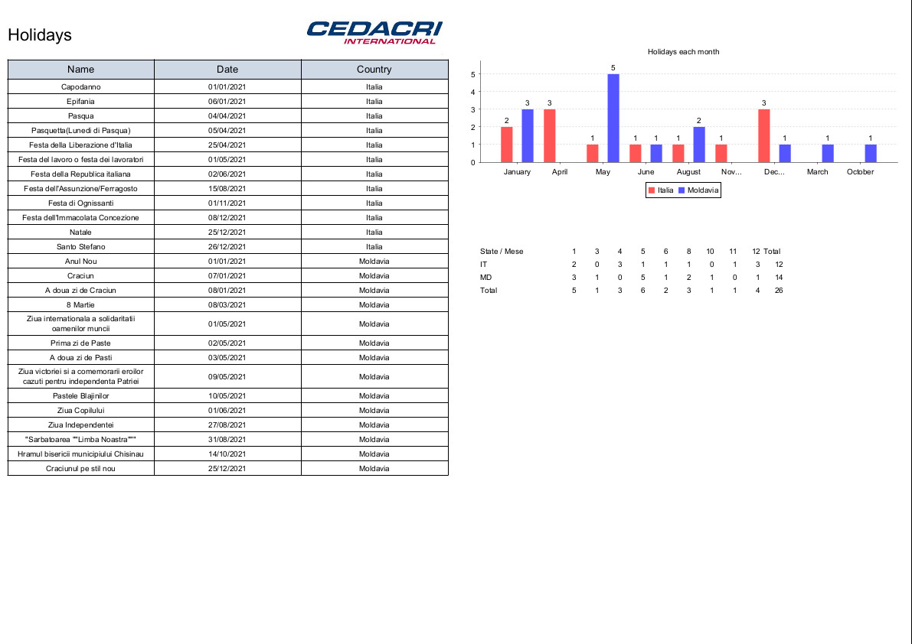

# Dynamic Reports in Java

#### Database: [MySQL Connector](https://mvnrepository.com/artifact/com.mysql/mysql-connector-j)
```xml
<dependency>
    <groupId>com.mysql</groupId>
    <artifactId>mysql-connector-j</artifactId>
    <version>8.2.0</version>
</dependency>
```

#### Library: [DynamicReports Core](https://mvnrepository.com/artifact/net.sourceforge.dynamicreports/dynamicreports-core)
```xml
<dependency>
    <groupId>net.sourceforge.dynamicreports</groupId>
    <artifactId>dynamicreports-core</artifactId>
    <version>6.20.0</version>
</dependency>
```

---
## Report
